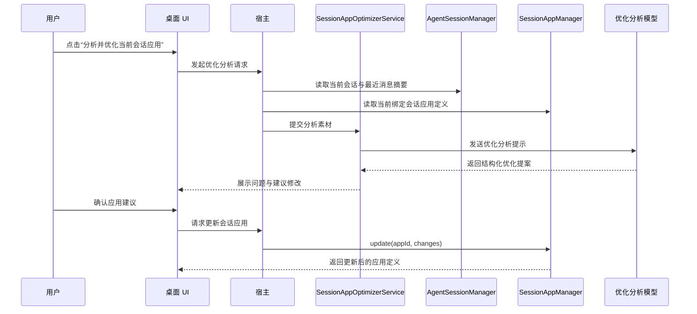

# 会话应用优化提案机制设计（备忘）

> 最后更新：2026-07-02
> 状态：设计备忘，暂未实现
> 本文档只记录“会话应用如何在真实运行后被分析、给出升级建议、并由用户确认更新”的设计方向，不代表当前产品已经具备自动优化能力。

---

## 一、要解决什么问题

会话应用一旦进入真实使用，通常会逐步暴露出一些可优化点，例如：

- 系统提示词不够清晰
- 启动消息模板不够稳定
- 默认工作目录或默认上下文不合理
- 能力边界太宽或太窄
- 用户在历史会话里反复追加同类纠正语句

当前产品已经支持：

- 创建会话应用
- 修改会话应用
- 启动会话应用新会话
- 在聊天里通过内置 MCP 直接读写会话应用

但还缺少一层明确的“运行后复盘与升级提案”机制。

因此这里要补的，不是“自动自我改写的隐式智能体”，而是：

**面向会话应用的分析、提案、确认式升级机制**

---

## 二、核心结论

本轮讨论后的产品结论如下：

1. 有必要做。
2. 不能把优化逻辑直接混进业务会话本身。
3. 不应让模型在用户无感知情况下静默修改应用定义。
4. 第一阶段应以“分析并给出升级提案”为主，而不是自动升级。
5. 该能力仅对“绑定了会话应用的会话”生效，不影响普通 Agent 会话。

换句话说，会话应用优化器应当是：

**宿主侧发起的旁路分析服务**

而不是：

- 每轮业务对话里偷偷注入一段“自我反思提示词”
- 业务会话结束后直接静默覆盖应用定义
- 把普通会话也统一纳入自动改写逻辑

---

## 三、推荐形态

推荐把这项能力定义为：

**会话应用优化提案**

它的标准闭环是：

1. 用户或宿主发起一次“分析当前会话应用”
2. 系统读取当前会话绑定的应用定义
3. 系统结合最近使用情况生成优化建议
4. 产出结构化提案，而不是直接改写
5. 用户确认后，才真正更新应用定义

这样既保留了 AI 的优化能力，也保持了会话应用“定义清晰、变更可控”的产品边界。

---

## 四、为何不直接注入业务会话

不建议把“请你持续优化自己”这一类提示直接注入会话应用的业务会话，原因主要有四点：

- 会污染业务目标，模型容易在完成用户任务和评估自身之间来回摇摆
- 会增加每轮 token 开销，尤其在长会话中非常明显
- 会引入不可解释的行为变化，用户不知道应用为什么突然变了
- 会把“运行态思考”和“定义态修改”混为一体，破坏宿主边界

因此，优化分析必须和业务会话解耦。

---

## 五、触发方式设计

### 5.1 V1：用户主动触发

第一阶段最推荐先做用户主动触发。

建议入口：

- 会话应用管理详情页中的“分析并优化”
- 当前会话前方的会话应用图标菜单中增加“分析当前会话应用”

该模式的优点：

- 时机明确
- token 成本可控
- 用户心理预期稳定
- 不会打扰普通业务对话

### 5.2 V3：宿主低频提出建议

后续可选做低频“建议触发”，但仍不是自动升级。

适合的触发时机例如：

- 某个会话应用连续使用多次后
- 某个会话应用关联会话中频繁出现相同修正
- 工具调用失败模式高度重复
- 用户多次手工改写同类开场语句

该模式的产物仍应是：

- 一条建议
- 一个待确认提案

而不是直接修改应用定义。

### 5.3 不建议的 V2：每轮隐藏反思

不推荐实现“每轮对话都隐式反思一次当前会话应用定义”。

原因是：

- 性价比低
- token 消耗高
- 易扰动业务会话
- 很难向用户解释最终修改是如何产生的

---

## 六、适用范围

该优化器仅面向：

- 已绑定 `sessionAppId` 的会话
- 用户明确想优化的会话应用
- 或宿主识别为“值得复盘”的会话应用

不直接面向：

- 普通一次性会话
- Notebook 一般内容整理会话
- 复杂内嵌 App 的界面行为优化
- Hosted SDK / Standalone App 的独立产品逻辑

---

## 七、前置能力要求

要实现这项能力，至少需要先解决“当前会话到底绑定了哪个会话应用”的查询问题。

推荐前置能力包括：

- `session_get_current` 能返回 `sessionAppId`
- 内置 MCP 提供 `session_app_get_current`
- 能读取当前绑定应用的完整定义
- 能读取当前会话最近消息、工具使用和失败信息

其中 `session_app_get_current` 的价值很关键：

- 用户在聊天里直接说“先看看当前这个会话应用定义”
- 用户说“优化当前这个会话应用”
- 用户说“先分析当前应用，再给我建议”

此时模型不需要猜测应用 ID，也不需要凭记忆假定“刚才那个应用还存在”。

---

## 八、推荐架构

建议新增一个宿主侧服务：

`SessionAppOptimizerService`

它只负责“分析”和“生成提案”，不直接承担应用定义管理。

职责分层建议如下：

- `SessionAppManager`
  - 继续负责应用定义的增删改查和启动
- `AgentSessionManager`
  - 继续负责当前会话、消息和上下文
- `SessionAppOptimizerService`
  - 负责拉取分析所需素材
  - 组织优化提示
  - 调用模型生成提案
  - 把提案返回给 UI 或聊天侧

这样可以保持：

- 会话应用管理层不被分析逻辑污染
- 优化器可单独开关
- 未来更容易加入提案历史或审核机制

---

## 九、分析输入建议

优化器不需要拿整个超长原始会话全文。

第一阶段建议使用以下输入：

- 当前会话应用定义
- 当前会话基本信息
- 最近若干轮关键消息
- 最近的工具调用及失败摘要
- 用户显式纠正模型的语句摘要

推荐重点分析字段：

- `name`
- `description`
- `systemPrompt`
- `startupMessageTemplate`
- `defaultContext`
- `allowedCapabilities`

其中：

- `systemPrompt` 和 `startupMessageTemplate` 是第一优先级
- `allowedCapabilities` 当前更偏内部字段，短期不一定要暴露给用户手工编辑，但优化器可内部给出建议

---

## 十、输出形态建议

优化器输出不应是“已经帮你改好了”，而应是结构化提案。

建议数据结构如下：

```json
{
  "appId": "app_xxx",
  "sessionId": "session_xxx",
  "summary": "当前应用在启动约束和工具使用建议上不够明确。",
  "issues": [
    "系统提示词没有明确优先调用哪些内置能力。",
    "启动消息模板没有要求先确认输入完整性。"
  ],
  "suggestedChanges": {
    "description": "更新后的应用说明",
    "systemPrompt": "更新后的系统提示词",
    "startupMessageTemplate": "更新后的启动消息模板"
  },
  "rationale": [
    "最近多轮会话中都出现了重复澄清。",
    "模型对工具路径选择不稳定。"
  ],
  "riskNotes": [
    "更新后历史应用会话继续运行时也会跟随新定义。"
  ]
}
```

界面层或聊天层再基于这份提案提供：

- 仅查看建议
- 应用建议
- 局部采纳后再保存

---

## 十一、应用更新语义

当前会话应用模型已经简化为：

- 一个应用只有一份当前定义
- 不保留版本 / 草稿 / 发布态
- 修改直接覆盖当前定义

因此优化器一旦“应用建议”，真实语义应当是：

**直接更新该应用当前定义**

这也意味着：

- 新启动的应用会话会使用更新后的定义
- 已有关联历史会话后续继续运行时，也会跟随当前定义

这和当前会话应用的简化语义保持一致，不再引入隐藏快照或内部指纹。

---

## 十二、时序图



---

## 十三、和当前聊天内自然语言能力的关系

即使不立即实现正式优化器，当前也可以先支持一种“临时分析”工作方式：

1. 先读取当前会话应用定义
2. 再结合当前聊天内容，让模型给出升级建议
3. 用户确认后，再调用更新工具

这条链路仍然有价值，因为它已经能验证：

- 用户会不会真的需要“优化当前应用”
- 他们更常优化哪些字段
- 哪些建议是高频、可产品化的

适合用户的提问方式例如：

- `先读取当前这个会话应用定义，再给我优化建议，不要直接修改。`
- `分析当前会话绑定的会话应用，看看系统提示词和启动消息哪里需要改。`
- `先看当前应用定义，再建议如何升级。`

这类能力可以作为正式优化器上线前的过渡方案。

---

## 十四、V1 推荐落地范围

如果后续正式开发，推荐 V1 只做以下闭环：

1. 仅支持“当前会话绑定的会话应用”
2. 仅支持用户主动触发
3. 仅产出结构化提案
4. 仅在用户确认后写回应用定义
5. 不做静默自动升级
6. 不做普通会话适配

这样可以把复杂度控制在最小范围内，同时不破坏当前会话应用已稳定的产品模型。

---

## 十五、当前结论

这项能力值得做，但应作为：

**会话应用的旁路优化提案机制**

而不是：

- 会话内自我修改机制
- 无提示自动升级机制
- 普通会话通用后台反思机制

最稳妥的路线是：

1. 先补齐“读取当前绑定会话应用”的基础能力
2. 先允许聊天内临时分析和人工确认更新
3. 再实现独立的 `SessionAppOptimizerService`
4. 最后再考虑是否增加低频宿主侧建议提醒

这条路线能最大程度复用现有会话应用与内置 MCP 体系，同时保持原有功能边界不被侵入。
